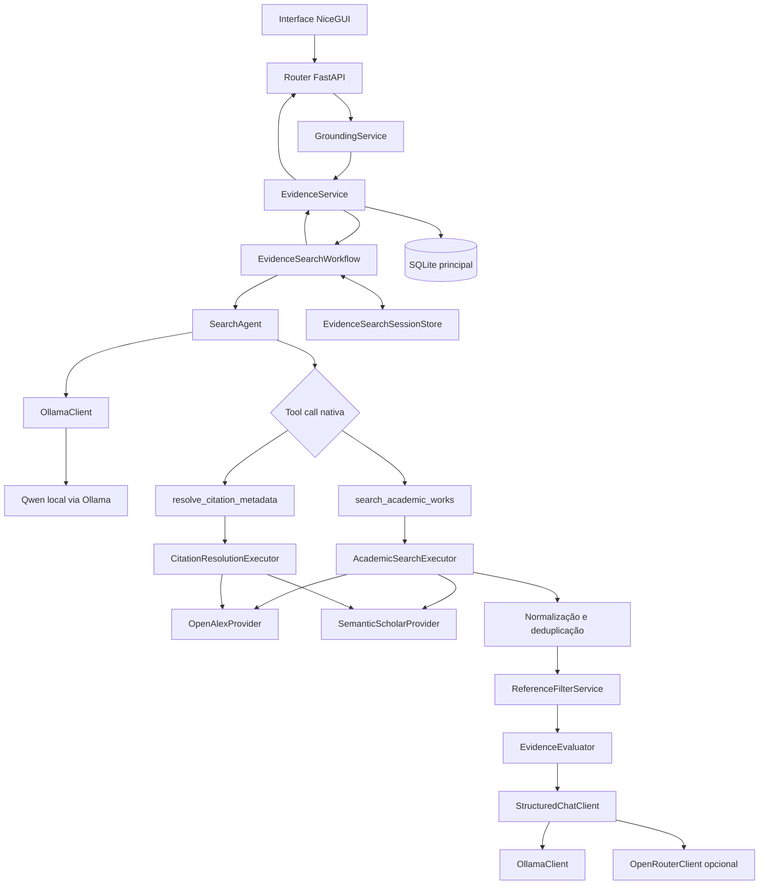

# VibeScholar

O VibeScholar é uma aplicação local acadêmica desenvolvida como MVP para apoiar a produção de textos científicos. O sistema reúne edição, organização, versionamento e análise heurística de documentos em uma interface construída integralmente em Python.

Está disponível, temporariamente no Render: h[ttps://vibescholar.onrender.com/dashboard](https://vibescholar.onrender.com/)

## Objetivo

O VibeScholar tem como objetivo auxiliar pesquisadores durante a produção de artigos científicos. A plataforma identifica sentenças que podem necessitar de fundamentação científica e oferece recursos para consultar, avaliar e organizar evidências associadas ao texto.

Além da análise de sentenças, o sistema centraliza projetos, documentos e referências, permitindo acompanhar a evolução do conteúdo e manter um histórico explícito de versões.

## Funcionalidades

- autenticação e cadastro de usuários;
- gerenciamento de projetos acadêmicos;
- criação, importação e gerenciamento de documentos;
- editor de texto integrado;
- salvamento automático de rascunhos;
- versionamento e carregamento de versões anteriores como rascunho;
- segmentação e organização de sentenças por parágrafo;
- detecção heurística de citações aparentes;
- análise do estado de fundamentação das sentenças;
- busca, aprovação e rejeição de sugestões de evidências;
- busca real de referências acadêmicas no OpenAlex e no Semantic Scholar;
- planejamento de busca e refinement com Qwen executado localmente pelo Ollama;
- avaliação estruturada do apoio científico oferecido por cada referência;
- biblioteca de referências por projeto;
- configurações de preferência para referências;
- exportação de documentos em formatos acadêmicos suportados pela aplicação;
- exclusão lógica de projetos e documentos.

## Tecnologias utilizadas

- **Python:** linguagem principal do projeto, utilizada tanto no backend quanto na construção da interface.
- **FastAPI:** framework responsável pela API HTTP, escolhido pela simplicidade de desenvolvimento, desempenho e geração automática de documentação da API.
- **NiceGUI:** biblioteca usada na interface web por sua integração direta com Python e pela rapidez de construção de interfaces para MVPs.
- **SQLAlchemy:** camada de persistência e mapeamento objeto-relacional, empregada para abstrair o acesso ao banco e organizar repositories e transações.
- **SQLite:** banco relacional utilizado no MVP por exigir pouca infraestrutura e permitir execução local imediata.
- **Pydantic:** utilizado na validação e serialização dos dados recebidos e retornados pela API.
- **Uvicorn:** servidor ASGI usado para executar a aplicação FastAPI e sua integração com o NiceGUI.

## Estrutura do projeto

```text
VibeScholar/
├── README.md
├── .gitignore
├── docs/                       # Documentação de requisitos e projeto
└── Vibescholar/
    ├── app.py                  # Launcher da aplicação
    ├── requirements.txt        # Dependências Python
    ├── conftest.py             # Configuração de testes
    └── app/
        ├── app.py              # Integração FastAPI e NiceGUI
        ├── core/               # Configurações e infraestrutura
        ├── models/             # Modelos SQLAlchemy
        ├── providers/          # Providers de evidências
        ├── repositories/       # Acesso e persistência de dados
        ├── routers/            # Endpoints FastAPI
        ├── schemas/            # Schemas Pydantic
        ├── services/           # Regras e casos de uso
        ├── ui/                 # Páginas, componentes e estado NiceGUI
        ├── utils/              # Funções utilitárias
        └── tests/              # Testes automatizados
```
## Escolhas de Design

Foi adotada uma arquitetura em camadas (Router → Service → Repository → SQLAlchemy) para separar as responsabilidades da API e da persistência. O pipeline de IA segue uma composição complementar e tipada, formada por Workflow → Agents → Tools → Executors → Providers.

A interface foi desenvolvida em NiceGUI por permitir construir toda a aplicação em Python, reduzindo a complexidade de sincronização entre frontend e backend durante o desenvolvimento do MVP.

SQLite foi escolhido por dispensar infraestrutura adicional e facilitar a execução local da aplicação, sendo suficiente para o escopo do protótipo.

No comportamento padrão, com `USE_MOCK=false`, as sugestões de evidências são produzidas pelo pipeline real de IA e pelos providers acadêmicos OpenAlex e Semantic Scholar. O modo mock pertence a uma etapa histórica do MVP e permanece disponível somente como caminho legado para regressão e desenvolvimento offline deliberado.

## Instalação

### Pré-requisitos

- Python 3.11 ou superior;
- Git.

Clone o repositório e acesse o diretório da aplicação:

```bash
git clone <URL_DO_REPOSITORIO>
cd VibeScholar/Vibescholar
```

Crie um ambiente virtual:

```bash
python -m venv .venv
```

Ative o ambiente no Windows:

```powershell
.venv\Scripts\Activate.ps1
```

No Linux ou macOS:

```bash
source .venv/bin/activate
```

Instale as dependências:

```bash
pip install -r requirements.txt
```

Defina uma chave de sessão antes de executar a aplicação. No PowerShell:

```powershell
$env:SECRET_KEY="uma-chave-local-segura"
```

No Linux ou macOS:

```bash
export SECRET_KEY="uma-chave-local-segura"
```

Execute a aplicação:

```bash
python app.py
```

Por padrão, a interface fica disponível em `http://127.0.0.1:8080`. O banco SQLite e as tabelas necessárias são inicializados automaticamente quando ainda não existem.

## Testes

Com o ambiente virtual ativo e a partir do diretório `Vibescholar/`, execute:

```bash
pytest app/tests/test_backend.py
```

## Processo de desenvolvimento assistido por IA

Este projeto também foi conduzido como um experimento acadêmico sobre o uso de diferentes modelos de inteligência artificial em atividades do ciclo de desenvolvimento de software. As ferramentas foram aplicadas em etapas distintas, incluindo levantamento de requisitos, arquitetura, implementação, testes e revisão estrutural.

As avaliações abaixo registram observações obtidas durante esse experimento específico. Elas dependem do hardware, das versões, dos limites de contexto, das configurações e das plataformas utilizadas; portanto, não constituem recomendações universais de configuração ou desempenho.

> **Nota histórica:** os prompts, planos e instruções reproduzidos nesta seção
> documentam etapas anteriores do desenvolvimento. Referências neles a
> `MockProvider`, `MockEvidenceService`, dados mock ou integrações “futuras”
> descrevem o estado do projeto naquele momento e não a arquitetura funcional
> atual. O estado vigente está documentado em
> [Arquitetura de IA generativa integrada](#arquitetura-de-ia-generativa-integrada).

### Qwen 3.5 9B

O Qwen 3.5 9B foi executado localmente por meio do Ollama. Inicialmente, atuou como analista de requisitos e, posteriormente, assumiu atividades próximas às de Product Owner. O modelo contribuiu para localizar ambiguidades, formular perguntas pertinentes e organizar necessidades do produto. O SDD localizado em docs foi construido por ele.

Na geração da arquitetura completa, foram observadas limitações relacionadas à capacidade da máquina utilizada:

- O modelo possua contexto oficial informado de até 262.144 tokens, o experimento com Ollama o limitava ao inicial de 4.096 tokens, o que trouxe necessidade de correção em ambiente de execussão.
- Pelas capacidades do notebook utilizado, uma tarefa poderia demorar entre 1 a 5 horas para ser realizada.
- Por vezes, o modelo pensava tanto que ocupava todo o espaço do contexto, resultando em crash.

Durante as atividades de arquitetura, a temperatura utilizada ficou de `0.5`, com a maior janela de contexto viável no ambiente. Na geração de código, a redução do `presence_penalty` de  `1.5` para `0.3` produziu resultados mais adequados ao experimento. Esses valores representam somente observações práticas desse ambiente.

Foram utilizados prompts como:

```text Você atuará como Principal Software Architect, com experiência em arquitetura corporativa, DDD, modelagem de domínio, engenharia de software e sistemas orientados à evolução de longo prazo.
Sua função nesta etapa NÃO é reescrever o documento.
Sua função é realizar uma revisão arquitetural crítica e independente do Software Design Document anexado.
Considere que este documento será a única fonte de verdade (Single Source of Truth) para a implementação do sistema."
```

Para correções do SDD.

### Gemini 2.5 Flash (Medium)

O Gemini 2.5 Flash, na configuração Medium, foi utilizado por meio do Antigravity. Apresentou baixa latência e foi útil na implementação de back/frontend e foi o principal criador do planos de implementação encontrados nos docs. Também executava testes para verificar as alterações realizadas.

Em mudanças muito extensas, entretanto, foi observado que partes do contexto podiam ser perdidas, exigindo tarefas mais delimitadas e validações adicionais.

### Claude Sonnet 4.6 Thinking

O Claude Sonnet 4.6 Thinking também foi utilizado por meio do Antigravity. No período avaliado, apresentou boa organização de código e capacidade de raciocínio sobre as tarefas propostas, ajudou na infraestrutura e no backend. Sua participação foi menor devido à limitação de créditos disponíveis no ambiente experimental.

Tanto para o claude quanto para o gemini, foram utilizados os mesmos prompts, com o claude focado na implementação, e pedindo para que ele continuasse de onde o Gemini parou.

Exemplos de prompt:

```text Revise o Implementation Plan e incorpore as seguintes melhorias arquiteturais antes do início da implementação.

As alterações abaixo não modificam a arquitetura, apenas completam lacunas importantes.

1. Adicionar ProjectSettings

O projeto deve possuir uma entidade de configuração própria.

Criar:

models/project_settings.py

Modelo:

ProjectSettings
---------------
id
project_id (FK)

preferred_language

minimum_qualis

publication_year_min
publication_year_max

preferred_sources

only_open_access

prefer_doi

max_suggestions

created_at
updated_at

Essas configurações pertencem ao Projeto e serão utilizadas pelo EvidenceService para filtrar sugestões.

2. Adicionar tela Settings no Workspace

O Workspace deve possuir quatro áreas principais:

Workspace

Editor

Evidence

Reference Library

Settings

A aba Settings permitirá configurar:

idioma
Qualis mínimo
intervalo de anos
bases habilitadas
Open Access
DOI obrigatório
número máximo de sugestões
3. Atualizar o EvidenceService

Hoje está:

search(sentence)

Alterar para:

search(sentence, project_settings)

O serviço deverá aplicar os filtros definidos nas configurações do projeto antes de retornar sugestões.

O MockEvidenceService também deverá respeitar esses filtros.

4. Criar camada Repository

O plano atualmente coloca boa parte da lógica diretamente nos routers.

Adicionar uma camada:

repositories/

user_repository.py

project_repository.py

document_repository.py

reference_repository.py

Fluxo desejado:

Router

↓

Service

↓

Repository

↓

SQLAlchemy

Isso facilita testes e futuras migrações.

5. Criar pasta utils

Adicionar:

utils/

markdown.py

text_normalizer.py

sentence_splitter.py

validators.py

Evita duplicação de código.

6. Criar pasta exceptions

Adicionar:

exceptions/

auth.py

document.py

reference.py

Para centralizar erros da aplicação.

7. Criar pasta core

Adicionar:

core/

security.py

config.py

logging.py

Toda configuração da aplicação deve ficar centralizada.

8. Adicionar Logging

Implementar logging estruturado para:

login
criação de projetos
criação de versões
aprovação de evidências
exportações

Usar o módulo logging do Python.

9. Adicionar Soft Delete

Nenhuma entidade principal deve ser removida fisicamente.

Adicionar:

deleted_at

nas entidades:

Project
Document
Reference

Exclusões devem ser lógicas.

10. Índices do banco

Adicionar índices para:

document_versions(document_id)

sentences(document_version_id)

sentences(sentence_uuid)

evidence_suggestions(document_version_id)

evidence_suggestions(sentence_uuid)

project_references(project_id)

quality_issues(document_version_id)
11. Importação de referências

A biblioteca de referências deve permitir:

entrada manual
BibTeX
CSV

Mesmo que o parser seja simples no MVP.

12. Exportação

Adicionar:

Markdown
DOCX
PDF
BibTeX
APA
ABNT
13. Seed de desenvolvimento

Criar automaticamente:

admin

admin123

com

projeto exemplo
documento exemplo
referências mock

Assim o avaliador consegue testar rapidamente.

14. Configuração futura das APIs

Mesmo usando MockEvidenceService no MVP, criar desde já a estrutura:

providers/

interfaces.py

mock_provider.py

openalex_provider.py

semantic_scholar_provider.py

Apenas o Mock será implementado.

15. Estrutura final

A estrutura final esperada do projeto passa a ser:

app/

config/

core/

exceptions/

models/

repositories/

services/

providers/

routers/

schemas/

utils/

gui/

static/

templates/

tests/

adicionar também função de importação de documento:
Uma nova rota:

POST /api/documents/import

Aceitando

.docx
.md
.txt

Fluxo:

Upload

↓

Detecta extensão

↓

Converte para Markdown

↓

Cria Document

↓

Abre no Editor
Serviço

Criaria

services/import_service.py

com algo como

ImportService

import_docx()

import_markdown()

import_txt()
Bibliotecas

DOCX

python-docx

Markdown

markdown-it-py

TXT

open(...)

Na UI

Adicionar um botão

Novo Documento

Importar Documento

Quando clicar

Selecionar arquivo

↓

DOCX
TXT
Markdown

↓

Importar 
```

e para implementação:

```text
Você atuará como Engenheiro de Software Sênior responsável pela implementação do projeto VibeScholar.

Leia os documentos da pasta docs considerando a seguinte prioridade:

1. Implementation_Plan_v1 (fonte principal)
2. Implementation_Plan_v2 (complementa arquitetura)
3. Software Design Document (resolver ambiguidades)

Regras obrigatórias:

- Não altere a arquitetura.
- Não simplifique o escopo.
- Não adicione funcionalidades não especificadas.
- Em caso de conflito siga V1 → V2 → SDD.
- Gere código pronto para execução.
- Sempre preserve consistência entre os arquivos.
- Ao terminar exatamente o escopo solicitado, pare e aguarde o próximo prompt.

Primeira parte:
Implemente toda a infraestrutura do projeto.

Escopo:

- estrutura completa de diretórios
- pyproject.toml ou requirements.txt
- app.py
- configuração do FastAPI
- integração NiceGUI
- configuração SQLite
- SQLAlchemy
- SessionLocal
- Base
- engine
- logging
- security
- config
- criação automática das tabelas
- seed do banco
- usuário admin
- referências mock

Também implemente todos os modelos SQLAlchemy:

- User
- Project
- ProjectSettings
- Document
- DocumentVersion
- Sentence
- GroundingReport
- QualityIssue
- ProjectReference
- EvidenceSuggestion

Implemente também todos os Schemas Pydantic.

Não implemente Services.

Não implemente Routers.

Não implemente Interface.

Ao terminar pare. 
```

### Codex GPT-5.5

O Codex GPT-5.5 foi empregado na revisão estrutural do projeto, na comparação entre implementação e documentação e na identificação de violações de regras de negócio. Durante o experimento, mostrou boa capacidade para localizar inconsistências distribuídas entre diferentes camadas e apresentou baixa incidência de respostas factualmente incompatíveis com o código analisado. No entanto, aconteceram por vezes, especialmente envolvendo regras de negócio. Foi necessária certa intervenção humana.


### Codex GPT-5.6

O Codex GPT-5.6 foi utilizado nos refinamentos finais da implementação. As sugestões apresentaram qualidade técnica consistente no contexto avaliado, acompanhadas, porém, de consumo de créditos significativamente maior.

Algumas correções de bugs relacionados ao ciclo de vida dos componentes do NiceGUI exigiram investigação manual antes da geração do prompt apropriado.

O Chatgpt auxiliou na geração dos prompts.

Exemplo de prompt(uma vez que o contexto já estava carregado):

```text
Corrija exclusivamente três problemas: exclusão de projeto, erro 500 na busca mock de evidências e apresentação das sentenças por
  parágrafo.

  Não faça refatoração geral, não implemente integração externa e não altere funcionalidades que já estão operacionais.

  ## Arquivos inicialmente permitidos

  * `app/ui/pages/dashboard.py`
  * `app/ui/pages/workspace.py`
  * `app/ui/api_client.py`
  * `app/routers/grounding.py`
  * `app/services/grounding_service.py`
  * `app/services/evidence_service.py`
  * `app/providers/mock_provider.py`
  * `app/repositories/reference_repository.py`
  * `app/repositories/document_repository.py`, somente se necessário para consultar sugestões existentes
  * seeders atualmente usados para criar referências mock
  * testes relacionados

  Não altere models, migrations ou estrutura do banco sem demonstrar uma incompatibilidade objetiva.

  # 1. Exclusão de projeto e ciclo de vida dos elementos NiceGUI

  ## Problema confirmado

  * clicar na lixeira abre o diálogo;
  * o diálogo desaparece antes da confirmação;
  * o dashboard parece sofrer refresh;
  * a exclusão de documento já funciona e pode servir de referência.

  O log também apresenta:


  An element has been deleted but is still being used.

  Em outro fluxo do dashboard, o callback executa um refresh e depois tenta manipular um botão que já foi destruído pelo
  `@ui.refreshable`.

  ## Investigue

  * se o diálogo de projeto é criado dentro de `dashboard_content`, que é `@ui.refreshable`;
  * se clicar na lixeira também seleciona o card;
  * se há chamada de `dashboard_content.refresh()` ao abrir o diálogo;
  * se uma atualização do state provoca refresh;
  * se o callback tenta habilitar, desabilitar, fechar ou modificar elementos depois de um refresh que os destruiu;
  * se o botão possui callbacks duplicados;
  * se o card inteiro possui evento de clique que também é disparado pela lixeira.

  ## Correção obrigatória

  * criar um único diálogo persistente de exclusão fora do conteúdo recriado por `@ui.refreshable`;
  * criar esse diálogo no escopo estável de `dashboard_page`;
  * manter o projeto pendente de exclusão em um estado mutável simples, por exemplo:


  project_pending_delete = {"project": None}

  * clicar na lixeira deve apenas:

    * impedir a propagação para o card;
    * guardar o projeto;
    * atualizar o texto do diálogo;
    * abrir o diálogo;
  * não selecionar projeto;
  * não navegar;
  * não alterar `current_project`;
  * não executar refresh;
  * cancelar deve somente limpar o projeto pendente e fechar o diálogo;
  * confirmar deve chamar DELETE de forma assíncrona;
  * somente após DELETE bem-sucedido:

    * fechar o diálogo;
    * limpar o projeto pendente;
    * limpar `current_project` e `current_document` se necessário;
    * executar exatamente um `await dashboard_content.refresh()`.

  ## Regra de ciclo de vida

  Depois de executar `await dashboard_content.refresh()`, não manipule componentes que pertenciam à versão anterior do conteúdo,
  incluindo:

  * botão de excluir;
  * botão de confirmar;
  * botão de criar;
  * labels ou dialogs criados dentro do refreshable.

  Não faça chamadas como `.enable()`, `.disable()`, `.close()` ou `.set_text()` em elementos destruídos pelo refresh.

  Adicione logs:

  * `project.delete.dialog_open`;
  * `project.delete.cancel`;
  * `project.delete.confirm`;
  * resposta do DELETE;
  * início e fim do único refresh;
  * quantidade de callbacks disparados por clique.

  # 2. Busca de evidências — causa exata confirmada

  ## Erro confirmado

  O endpoint retorna 500 porque tenta inserir:

  document_version_id = 16
  sentence_uuid = b646f53a-cae0-4b35-89f3-f07f28d5370e
  reference_id = -3
  status = PENDING


  O SQLite retorna:


  FOREIGN KEY constraint failed


  O traceback aponta para:

  * `GroundingService.search_sentence_evidence`;
  * `ReferenceRepository.create_suggestion`;
  * `db.commit()`.

  A causa é o mock provider gerar IDs artificiais ou negativos que não correspondem a registros persistidos em `project_references`.

  ## Correção obrigatória

  * nunca persistir `EvidenceSuggestion.reference_id` com:

    * ID negativo;
    * ID `None`;
    * ID inexistente;
  * o mock provider pode produzir dados de referência sem ID, mas antes de criar uma sugestão cada referência deve:

    * ser localizada no banco por DOI ou combinação estável de título/ano;
    * ou ser persistida em `project_references`;
    * receber um ID real do banco;
  * somente depois criar a `EvidenceSuggestion`;
  * todas as sugestões devem referenciar registros reais e ativos;
  * não usar IDs inventados como `-1`, `-2` ou `-3`;
  * referências mock podem ser globais com `project_id=None` ou pertencentes ao projeto, conforme o modelo já permite;
  * não criar duplicata para a combinação:

    * `document_version_id`;
    * `sentence_uuid`;
    * `reference_id`;
  * sugestões já aprovadas ou rejeitadas não devem reaparecer como novas;
  * executar `db.rollback()` obrigatoriamente se o `commit()` falhar;
  * a sessão deve continuar utilizável após a falha;
  * não retornar 500 bruto para erro conhecido;
  * sentença inexistente deve retornar 404;
  * ausência de sugestões deve retornar 200 com `[]`.

  ## Comportamento mock esperado

  Para qualquer sentença textual válida:

  1. tentar correspondência temática;
  2. aplicar configurações do projeto;
  3. usar fallback acadêmico genérico se não houver correspondência;
  4. retornar de 3 a 5 sugestões, desde que existam referências compatíveis;
  5. se os filtros do usuário eliminarem todas, retornar uma lista vazia controlada ou informar que os filtros eliminaram os
  resultados.

  Garanta um pool persistido de pelo menos 12 referências mock, cobrindo:

  * inteligência artificial;
  * escrita científica;
  * integridade acadêmica;
  * recuperação de informação;
  * visão computacional;
  * redes neurais;
  * metodologia científica.

  ## Logging obrigatório

  Registrar:

  * `sentence_id`;
  * `sentence_uuid`;
  * `document_version_id`;
  * `project_id`;
  * configurações aplicadas;
  * quantidade de referências candidatas;
  * IDs reais encontrados ou criados;
  * IDs descartados;
  * sugestões já existentes;
  * quantidade final retornada;
  * rollback em caso de erro.

  Não registrar conteúdo sensível nem stack trace para respostas normais de domínio.

  ## Testes obrigatórios

  1. sentença válida retorna entre 3 e 5 sugestões;
  2. todos os `reference_id` retornados existem no banco;
  3. nenhum `reference_id` é negativo;
  4. nenhuma sugestão possui `reference_id=None`;
  5. segunda busca não cria duplicatas;
  6. sugestões rejeitadas não reaparecem como novas;
  7. sugestões aprovadas continuam associadas, mas não reaparecem como pendentes;
  8. sentença inexistente retorna 404;
  9. filtros sem resultado retornam resposta controlada;
  10. falha de integridade executa rollback e não deixa a sessão em `PendingRollbackError`.

  # 3. Apresentação das sentenças por parágrafo

  Não implemente clique direto no Quill nesta etapa.

  Use os dados já existentes de `paragraph_number`.

  ## Comportamento esperado

  * agrupar sentenças por `paragraph_number`;
  * adicionar um seletor:

    * Todos os parágrafos;
    * Parágrafo 1;
    * Parágrafo 2;
    * etc.;
  * ao selecionar um parágrafo, mostrar somente as sentenças dele;
  * exibir a quantidade, como:

    * `3 sentenças neste parágrafo`;
  * não fazer nova chamada HTTP ao trocar o filtro;
  * não recarregar a página;
  * não recriar o workspace inteiro;
  * preservar o filtro enquanto o componente atual continuar ativo;
  * caso `paragraph_number` seja nulo, agrupar como `Sem parágrafo identificado`.

  ## Evidências visíveis na sentença

  Para cada sentença, mostrar:

  * texto resumido;
  * status atual;
  * quantidade de evidências aprovadas;
  * títulos resumidos das referências aprovadas, se a API já fornecer esses dados;
  * indicador de citação aparente, quando existir;
  * botão:

    * `Buscar evidências`, se não houver aprovadas;
    * `Ver / adicionar evidências`, se houver ao menos uma aprovada.

  Se a resposta atual de sentenças não contiver referências aprovadas, prefira enriquecer a resposta no service/repository já
  existente. Não faça uma requisição HTTP por sentença, pois isso criaria problema N+1.

  # Regras gerais

  * callbacks NiceGUI com HTTP devem ser assíncronos;
  * usar `httpx.AsyncClient`;
  * não aumentar timeout;
  * não usar `time.sleep`;
  * não usar timers ou background tasks para esconder erros;
  * não usar `except Exception: pass`;
  * não executar o servidor dentro do Codex;
  * não excluir, mover ou renomear arquivos;
  * não alterar autenticação, exportação, importação, configurações ou exclusão de documentos nesta etapa.

  # Validação

  Execute:

  * `python -m py_compile` nos arquivos alterados;
  * `python -m compileall -b app`;
  * remover somente os `.pyc` gerados fora de `__pycache__`;
  * testes backend;
  * teste de exclusão sem refresh prematuro;
  * teste de ciclo de vida garantindo que nenhum elemento destruído seja manipulado;
  * testes de busca mock e integridade referencial;
  * teste de não duplicação;
  * teste do agrupamento por parágrafo.

  Ao final informe:

  1. causa exata do diálogo desaparecer;
  2. onde o diálogo persistente foi criado;
  3. quantos refreshes ocorrem na exclusão;
  4. causa exata da foreign key inválida;
  5. origem do `reference_id=-3`;
  6. como referências mock passam a obter IDs reais;
  7. quantidade de sugestões retornadas;
  8. comportamento em buscas repetidas;
  9. como evidências aprovadas aparecem na UI;
  10. como o filtro por parágrafo funciona;
  11. arquivos alterados;
  12. confirmação de que nenhum arquivo foi excluído.
```

## Observações

Atualmente, com `USE_MOCK=false`, as sugestões de evidências são produzidas pelo pipeline real de IA generativa. O SearchAgent usa Qwen local por meio do Ollama, e as referências acadêmicas são recuperadas pelas APIs oficiais do OpenAlex e do Semantic Scholar.

O modo `USE_MOCK=true` registra uma etapa anterior do MVP. Ele permanece isolado como alternativa legada para testes de regressão e desenvolvimento offline, não é o fluxo padrão e não deve ser utilizado para representar o funcionamento atual da aplicação.

O SQLite é adequado para execução local e demonstração. Em uma implantação com múltiplas instâncias ou requisitos maiores de persistência e concorrência, a estratégia de banco de dados deve ser reavaliada.

## Arquitetura de IA generativa integrada

> **Atualização do estado do projeto:** as observações anteriores sobre o
> `MockProvider` registram uma etapa histórica do MVP. No estado atual,
> `USE_MOCK=false` é o comportamento padrão e ativa o pipeline real descrito
> abaixo. O modo mock permanece apenas como mecanismo legado para regressão e
> desenvolvimento offline deliberado.

### Problema e solução

O VibeScholar usa IA generativa para apoiar a fundamentação de sentenças
acadêmicas. A aplicação não pede ao modelo que invente referências. Em vez
disso, separa a tarefa em decisões especializadas:

1. o `SearchAgent` analisa a sentença e decide se deve iniciar uma busca
   acadêmica ou resolver os metadados de uma citação explícita;
2. tools tipadas consultam providers acadêmicos reais;
3. regras determinísticas deduplicam e filtram os candidatos;
4. o `EvidenceEvaluator` avalia, somente a partir de título e resumo, quanto
   cada candidato sustenta a sentença;
5. o backend persiste apenas referências com apoio forte ou parcial e mantém a
   aprovação final sob controle humano.

Essa decomposição evita atribuir ao LLM responsabilidades operacionais como
acesso ao banco, seleção de provider, persistência, deduplicação ou aprovação
automática.

### Fluxo completo



O fluxo não é um agente autônomo irrestrito. O
`EvidenceSearchWorkflow` coordena as etapas em Python, limita a execução a até
três rodadas sequenciais e usa apenas resultados tipados. Cada rodada realiza
no máximo uma inferência do `SearchAgent` e uma tool call. O resultado da tool
não é devolvido ao Qwen, não existe mensagem `role="tool"` e não ocorre uma
segunda inferência do agente na mesma rodada.

### Componentes e responsabilidades

| Componente | Responsabilidade | Não faz |
|---|---|---|
| `SearchAgent` | Escolhe semanticamente entre nenhuma ação e uma das duas tools; formula uma query principal | Não acessa banco, providers ou UI; não avalia evidências |
| Tools | Expõem contratos estritos e encaminham a execução autorizada | Não escolhem providers nem persistem resultados |
| Executors | Executam providers, agregam resultados e constroem resultados tipados | Não usam LLM nem conhecem a interface |
| Providers | Consultam e normalizam OpenAlex ou Semantic Scholar | Não conhecem outros providers, tools ou banco |
| `ReferenceFilterService` | Aplica critérios objetivos antes da avaliação semântica | Não chama LLM e não interpreta apoio científico |
| `EvidenceEvaluator` | Classifica cada candidato contra a sentença | Não busca, não ranqueia candidatos e não aprova referências |
| `EvidenceSearchWorkflow` | Controla sessão, rodadas, reservas, batches e condições de parada | Não monta prompts nem acessa clientes LLM diretamente |
| `EvidenceService` | Atua como fachada pública e coordena persistência/apresentação | Não executa a lógica agentiva |

### Escolha de modelo e provedores

#### SearchAgent: Qwen local com Ollama

O `SearchAgent` usa por padrão o modelo `qwen3.5:9b` executado localmente pelo
Ollama. A escolha prioriza:

- privacidade da sentença acadêmica;
- ausência de custo por chamada;
- possibilidade de demonstrar tool calling com um modelo aberto;
- execução local e reproduzível;
- controle explícito dos parâmetros de inferência.

As principais limitações são latência elevada no hardware disponível, menor
robustez de tool calling quando comparado a modelos comerciais maiores e maior
sensibilidade à formulação do schema e do prompt. Por isso, todas as decisões
do modelo são validadas pelo backend e nenhuma ação arbitrária é aceita.

O SearchAgent normalmente permanece local, mesmo quando o avaliador usa
OpenRouter. Essa separação evita enviar a sentença para um provedor pago apenas
para planejar a busca e impede que uma configuração do avaliador altere o
comportamento do agente.

#### EvidenceEvaluator: backend substituível

O `EvidenceEvaluator` depende somente do protocolo mínimo
`StructuredChatClient`, cuja operação pública retorna diretamente um
`BaseModel` Pydantic validado. O backend padrão também é o Ollama, mas pode ser
selecionado explicitamente como OpenRouter:

```text
EVIDENCE_EVALUATOR_BACKEND=ollama
```

ou:

```text
EVIDENCE_EVALUATOR_BACKEND=openrouter
OPENROUTER_API_KEY=<chave>
OPENROUTER_MODEL=<modelo permitido>
OPENROUTER_ALLOWED_MODELS=<lista CSV>
OPENROUTER_ALLOW_PAID_MODELS=false
```

Não há seleção automática por presença de chave, fallback automático, retry
automático ou troca silenciosa de modelo. O padrão `ollama` evita chamadas e
custos acidentais. Modelos pagos podem ser bloqueados por configuração.

Se um modelo comercial de maior capacidade for conectado ao avaliador, espera-se
menor latência e maior consistência na classificação estruturada. Em troca,
existem custo por token, dependência de rede e menor privacidade. A arquitetura
permite essa substituição sem alterar o `EvidenceEvaluator`, o workflow, os
filtros ou os providers.

### Escolha de SDK e framework

Foi utilizada diretamente a **OpenAI Python SDK**, configurada para endpoints
compatíveis:

- Ollama em `/v1`, para execução local;
- OpenRouter, opcionalmente, apenas para o `EvidenceEvaluator`.

Não foram usados LangChain, LangGraph, CrewAI ou outro framework de agentes.
Essa decisão foi deliberada porque o fluxo possui somente duas tools, contratos
Pydantic explícitos e regras de coordenação bem delimitadas. A SDK fornece
diretamente os dois recursos necessários:

- function calling nativo;
- structured output por JSON Schema.

Evitar um framework adicional reduz dependências, abstrações e comportamento
implícito. A desvantagem é que validação, estado, exceções e observabilidade
precisam ser implementados explicitamente, o que foi considerado adequado para
o escopo acadêmico e torna as decisões de engenharia visíveis no código.

### System prompts e estratégia de prompting

Os prompts ativos estão versionados separadamente do código:

- [`Vibescholar/prompts/search_agent_system.txt`](Vibescholar/prompts/search_agent_system.txt);
- [`Vibescholar/prompts/search_refinement_system.txt`](Vibescholar/prompts/search_refinement_system.txt);
- [`Vibescholar/prompts/evidence_evaluator_system.txt`](Vibescholar/prompts/evidence_evaluator_system.txt).

Eles usam seções semânticas semelhantes a XML, como `<role>`, `<context>`,
`<decision_rules>`, `<constraints>` e `<output>`. Essa organização torna as
responsabilidades e proibições mais fáceis de inspecionar e reduz ambiguidades
sem misturar dados do usuário às instruções de sistema.

#### Prompt do SearchAgent

O prompt define uma persona de agente acadêmico preciso, conservador e
determinístico. As regras principais são:

- escolher nenhuma ou exatamente uma tool;
- usar `search_academic_works` para novas referências;
- usar `resolve_citation_metadata` para citações explícitas ou incompletas;
- produzir exatamente uma query acadêmica principal por rodada;
- não escolher providers;
- não inventar resultados;
- não avaliar evidências;
- não persistir dados.

A sentença e as dicas de citação são serializadas como dados JSON em uma
mensagem de usuário. Instruções maliciosas dentro da sentença continuam sendo
tratadas como conteúdo acadêmico não confiável, e não como parte do system
prompt.

#### Prompt de refinement

O refinement recebe somente a sentença original e um `SearchRoundSummary`
agregado. O modelo não recebe títulos, abstracts, DOI, ISSN, candidatos ou
avaliações individuais. Ele deve decidir entre encerrar ou formular uma única
query diferente para a rodada seguinte.

Essa estratégia limita vazamento de metadados, reduz contexto e mantém no
backend as decisões operacionais de parada, quantidade de rodadas e tratamento
de falhas.

#### Prompt do EvidenceEvaluator

O avaliador recebe de um a cinco candidatos por lote, contendo somente:

- `candidate_key`;
- título;
- abstract opcional.

Cada candidato é comparado exclusivamente com a sentença. O prompt proíbe uso
de conhecimento externo, comparação entre candidatos, ranking, invenção de
metadados, consulta a Qualis e aprovação automática.

Não foi adotado few-shot nesta versão. A opção reduz o contexto e a latência do
modelo local, enquanto os enums, o JSON Schema e as regras explícitas já
delimitam a saída. Também não é solicitado nem armazenado chain-of-thought. O
modelo devolve apenas o resultado estruturado e uma justificativa curta; o
controle operacional permanece verificável no código Python.

### Tools disponibilizadas ao LLM

O Qwen recebe exatamente duas function tools:

| Tool | Quando deve ser usada | Entrada controlada |
|---|---|---|
| `search_academic_works` | Quando uma alegação científica precisa de novas referências | Exatamente uma query principal |
| `resolve_citation_metadata` | Quando existem DOI, título, autor/ano ou outros indícios explícitos de citação | Uma ou mais dicas de citação tipadas |

Os schemas são gerados com `model_json_schema()` a partir dos models Pydantic e
enviados com modo estrito. O nome recebido na tool call deve corresponder
exatamente à allowlist; aliases, nomes aproximados e fuzzy matching são
rejeitados.

O limite de resultados não é escolhido pelo LLM. A fonte de verdade é
`RESULTS_PER_PROVIDER`, com valor padrão atual de `10`. Assim, o agente decide
**se** buscar e **qual query** usar, enquanto o backend decide quanto recuperar.
OpenAlex e Semantic Scholar são consultados concorrentemente, com no máximo uma
busca lógica por provider e por rodada.

Argumentos inválidos, múltiplas tool calls, tool desconhecida e executor
indisponível geram falhas tipadas. Não existe reparo silencioso, truncamento de
argumentos ou nova inferência para corrigir a chamada.

### Structured outputs e validação

Pydantic é a fonte de verdade dos contratos de IA. O pipeline usa structured
output em diferentes fronteiras:

- `SearchPlan` para uma decisão sem tool;
- schemas Pydantic dos argumentos de cada tool;
- `SearchToolExecutionOutcome` construído pelo backend;
- `EvidenceEvaluationBatch` para a avaliação semântica;
- `SearchRoundSummary` para o refinement.

O OllamaClient e o OpenRouterClient solicitam JSON Schema estrito por meio da
OpenAI SDK e validam novamente o conteúdo com o model Pydantic esperado. Os
métodos públicos não retornam `dict`, texto cru ou `None`.

Depois da validação estrutural, o `EvidenceEvaluator` ainda verifica:

- uma avaliação para cada `candidate_key` recebido;
- ausência de chaves inventadas, alteradas ou duplicadas;
- ordem igual à entrada;
- coerência entre presença de abstract e `analysis_scope`;
- confiança entre `0` e `1`.

Falhas de timeout, conexão, modelo indisponível e resposta inválida são
representadas por exceções tipadas e convertidas em mensagens públicas seguras,
sem traceback, prompt ou credenciais.

### Parâmetros de inferência

Todos os parâmetros são centralizados em
[`Vibescholar/app/core/config.py`](Vibescholar/app/core/config.py) e podem ser
alterados por variáveis de ambiente.

| Parâmetro | Padrão | Justificativa |
|---|---:|---|
| `OLLAMA_MODEL` | `qwen3.5:9b` | Modelo aberto com structured output e tool calling no ambiente local usado |
| `LLM_TEMPERATURE` | `0.1` | Baixa variação para decisões e classificações mais consistentes, sem tornar a formulação de queries totalmente rígida | #Pode ser aumentada a 0.3, mas,especialmente para o qwen, não é aconselhavel. quanto mais deterministico, melhor.
| `LLM_TOP_P` | `0.9` | Mantém diversidade lexical limitada, subordinada à baixa temperatura | #Uma vez que, especialemente para o refinement, precisamos de sinônimos mais variáveis, mas que ainda se encaixem no pedido.
| `LLM_FREQUENCY_PENALTY` | `0.0` | Evita penalizar artificialmente termos acadêmicos que precisam se repetir | #Como lidamos com queries, a ideia é não penalizar o modelo por `AND` ou `OR`
| `LLM_PRESENCE_PENALTY` | `0.0` | Evita incentivar assuntos novos fora da sentença |
| `LLM_SEED` | não definido | Permite execução sem uma falsa promessa de determinismo; pode ser fixado em experimentos reproduzíveis |
| `EVIDENCE_EVALUATOR_MAX_OUTPUT_TOKENS` | `2000` | Limite conservador para até cinco avaliações estruturadas |
| `EVIDENCE_BATCH_SIZE` | `5` | Limita o contexto e a complexidade do structured output local |
| `MAX_SEARCH_ROUNDS` | `3` | Evita loops agentivos e custo/latência sem limite |
| `RESULTS_PER_PROVIDER` | `10` | Decisão operacional do backend, não do modelo |
| `TARGET_STRONG_EVIDENCE` | `5` | Meta determinística para encerramento bem-sucedido da sessão |

#As 4 variáveis acima podem ser modificadas, especialmente para se adequar a computadores sem muita capacidade para suportar modelos locais.

`LLM_TIMEOUT_SECONDS` também é configurável e deve ser ajustado conforme o
hardware e o backend utilizados. Os valores citados anteriormente na seção
“Processo de desenvolvimento assistido por IA” referem-se aos modelos usados
para desenvolver o software; não são necessariamente os parâmetros do pipeline
de IA executado pelo produto.

Quando `LLM_DIAGNOSTIC_LOGGING=true`, o cliente registra modelo, parâmetros,
duração, uso de tokens quando disponível e tamanho aproximado do contexto. Os
logs não incluem prompts, sentenças, títulos, abstracts, schemas completos,
respostas brutas ou chaves de API.

### Recuperação acadêmica e avaliação

O sistema implementa uma forma de recuperação aumentada por fontes acadêmicas,
mas não um RAG vetorial clássico. Não há vector database nem recuperação por
embeddings. A busca ocorre nas APIs oficiais do OpenAlex e do Semantic Scholar,
seguida por:

1. normalização para `ReferenceCandidate`;
2. deduplicação por DOI, título normalizado + ano e chave canônica;
3. filtros determinísticos;
4. avaliação semântica em lotes;
5. persistência seletiva e aprovação humana posterior.

Os verdicts do avaliador são:

- `strong_support`: sustenta diretamente a alegação central;
- `partial_support`: sustenta parte, contexto ou uma versão mais limitada;
- `no_support`: trata do tema, mas não sustenta a alegação;
- `contradicts`: apresenta conclusão incompatível;
- `insufficient_abstract`: título e resumo são insuficientes para julgar.

Resultados `partial_support` são preservados, mas não contam para a meta
principal de evidências fortes. A decisão de continuar para outra rodada é
determinística e nunca é delegada ao avaliador.

### Segurança e guardrails

Os principais controles são:

- separação entre system prompt e dados não confiáveis;
- allowlist exata de duas tools;
- no máximo uma tool call por inferência;
- uma query acadêmica por rodada;
- validação Pydantic de argumentos e respostas;
- nenhuma execução por nome arbitrário;
- nenhum `eval`, serialização de código ou plugin dinâmico;
- nenhum retorno de resultados internos completos ao Qwen;
- nenhum acesso do agente a SQLAlchemy ou credenciais de providers;
- logs sem conteúdo acadêmico sensível e sem API keys;
- ausência de retry e fallback automático nos clientes LLM;
- aprovação humana obrigatória antes de uma sugestão se tornar evidência
  aprovada.

Os resultados internos dos executores podem conter DOI, ISSN, URLs, candidatos
e metadados completos. Já os resultados públicos enviados entre fronteiras
agentivas contêm somente status, contagens e mensagens seguras.

### Experimentos e resultados observados

Os seguintes resultados foram observados durante a integração e orientaram
mudanças concretas:

| Observação | Resultado de engenharia |
|---|---|
| O Qwen chegou a gerar três queries em uma única tool call | O schema e os prompts passaram a exigir `minItems=1` e `maxItems=1`; listas inválidas são rejeitadas sem truncamento |
| O modelo solicitava somente cinco resultados mesmo quando o backend permitia mais | O limite foi removido da decisão agentiva e passou a ser controlado exclusivamente por `RESULTS_PER_PROVIDER=10` |
| O Semantic Scholar público retornou HTTP 429 enquanto o OpenAlex respondeu normalmente | O executor preserva os resultados válidos e produz `partial_success`, sem descartar toda a rodada |
| Uma tool com nome desconhecido escapava como erro não controlado | A correspondência continuou estrita, mas a falha passou a encerrar o pipeline de forma segura, sem executar provider ou nova inferência |
| O Qwen local apresentou alta latência | A interface mantém o estado de espera até a conclusão, os logs medem duração/contexto e o avaliador pode usar OpenRouter por configuração explícita |
| O avaliador local conseguiu produzir verdicts estruturados, mas também atingiu timeout em lotes posteriores | O erro é distinguido de uma busca vazia; não é convertido em “Nenhuma sugestão encontrada” |

#### Benchmark controlado


| Item avaliado | Configuração ou resultado |
|---|---|
| Backend e modelo do SearchAgent | Ollama - qwen 3.5:9b|
| Backend e modelo do EvidenceEvaluator | Open Router -  Tencent: Hy3 (free) |
| Temperaturas comparadas |0.1 e 0.3|
| Latência média do SearchAgent | 5 minutos com o qwen - pra 5 aprovações fortes|
| Latência média do EvidenceEvaluator | 35 minutos com o qwen - pra 5 aprovações fortes, 1 minuto no máximo com Hy3|
| Taxa de tool calls válidas | 3/5 para qwen, 5/5 para Hy3 |
| Taxa de structured outputs válidos | 4/5 para qwen, 5/5 para Hy3 |
| Taxa de timeout | Timeout é ajustavel, mas, como mencionado, qwen estorou timeout cerca de 2 vezes |
| Comparação Ollama × OpenRouter | A vantagem do Ollama é ser "de graça", com um computador mais capacitado, teria sido excelente. Já o Open Router, apesar de ser pago e não ter um limite free extenso, entrega bastante bem o que se propõe.  |
| Configuração escolhida após os testes |Foi necessário aumentar o timelimit do ollama, ajustar temperatura para 0.1, que costumava ser 0.3|
| Justificativa baseada nos resultados | para esse projeto, é preciso um modelo mais deterministico|

### O que funcionou

- function calling nativo com exatamente duas tools;
- schemas Pydantic comunicando ao modelo e ao backend o mesmo contrato;
- correção canônica e imutável de `candidate_key`;
- tolerância à falha isolada de provider;
- separação entre busca, filtros objetivos e julgamento semântico;
- refinement baseado somente em dados agregados;
- reaproveitamento de candidatos pendentes e reservas;
- mensagens públicas distintas para timeout, conexão, modelo indisponível e
  resposta inválida;
- troca do backend do avaliador sem condicionais dentro do agente;
- testes sem chamadas reais, usando fakes, mocks e transportes simulados.

### O que não funcionou ou permanece limitado

- a latência do Qwen local é alta no hardware disponível;
- o tool calling de modelos locais exige schemas e instruções muito explícitos;
- o acesso público ao Semantic Scholar pode sofrer rate limit;
- título e abstract não substituem a leitura do texto completo;
- metadados dos providers podem estar incompletos;
- o estado de busca é mantido em memória e não é compartilhado entre workers;
- a infraestrutura local de Qualis existe de forma isolada, mas ainda não
  enriquece nem filtra candidatos no pipeline, devido a uma incapacidade de encontrar fontes confiáveis;
- o modo mock legado ainda existe para regressão;
- não existe garantia de que cinco evidências fortes serão encontradas em até
  três rodadas;


### Organização dos arquivos de IA

```text
Vibescholar/
├── prompts/
│   ├── search_agent_system.txt
│   ├── search_refinement_system.txt
│   └── evidence_evaluator_system.txt
└── app/
    ├── agents/
    │   ├── search_agent.py
    │   ├── evidence_evaluator.py
    │   └── schemas.py
    ├── llm/
    │   ├── ollama_client.py
    │   ├── openrouter_client.py
    │   ├── protocols.py
    │   ├── factory.py
    │   └── exceptions.py
    ├── tools/
    │   ├── academic_search.py
    │   ├── citation_resolution.py
    │   └── schemas.py
    ├── providers/
    │   ├── openalex_provider.py
    │   └── semantic_scholar_provider.py
    └── services/
        ├── evidence_search_workflow.py
        ├── evidence_search_state.py
        ├── academic_search_executor.py
        ├── citation_resolution_executor.py
        └── reference_filter_service.py
```

### Resumo das decisões para defesa oral

- **Por que Qwen/Ollama?** Privacidade, custo zero por chamada e demonstração
  de um modelo aberto, aceitando a limitação de latência.
- **Por que OpenAI SDK?** Ollama e OpenRouter oferecem interfaces compatíveis,
  e a SDK já fornece tool calling e JSON Schema sem exigir um framework de
  agentes.
- **Por que temperatura `0.1`?** A tarefa exige consistência e aderência ao
  schema; alguma flexibilidade ainda é útil para formular queries.
- **Por que duas tools?** Elas representam as duas intenções acadêmicas
  distintas: descobrir novos trabalhos ou resolver uma citação já indicada.
- **Por que não LangChain?** O fluxo é pequeno, tipado e controlado; uma camada
  adicional esconderia decisões que são centrais para a avaliação.
- **Como prompt injection é tratada?** Dados do usuário ficam separados do
  system prompt, tools têm allowlist estrita e toda saída é revalidada.
- **O LLM aprova evidências?** Não. Ele produz verdicts estruturados; a
  persistência e a aprovação seguem regras do backend e ação humana.
- **O que mudaria com um modelo pago?** Provavelmente menor latência e maior
  consistência, em troca de custo, rede e privacidade. O avaliador já aceita
  outro backend sem mudança em sua lógica.

## Licença

Este projeto é disponibilizado sob a licença MIT. Consulte os termos da licença antes de redistribuir ou modificar o software.

